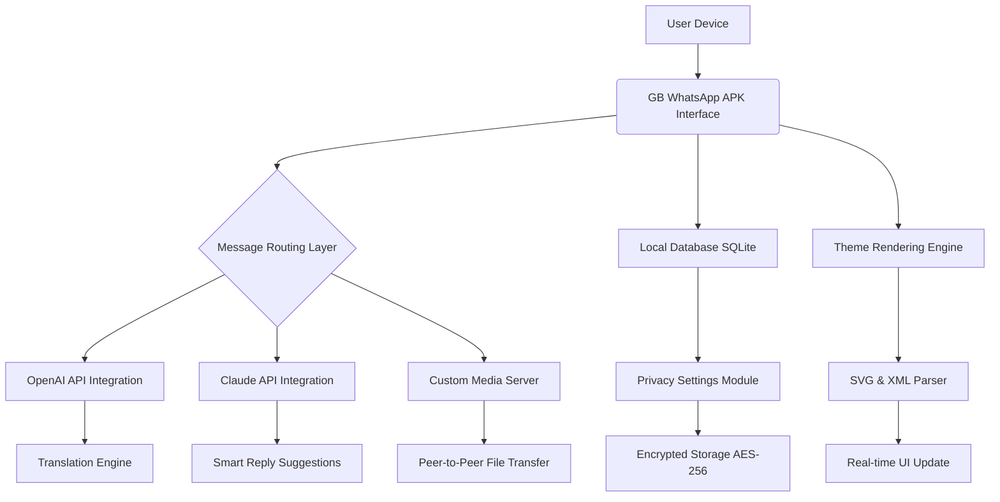

# GB WhatsApp APK — Seamless Communication Unbound

Welcome to the official repository for GB WhatsApp APK, a reimagined messaging experience that expands upon the foundation of standard communication platforms. This project delivers a feature-rich, community-driven alternative designed for users who seek greater control over their messaging environment, privacy settings, and customization options. Built on the principles of accessibility and innovation, this software empowers you to communicate without boundaries, offering a suite of advanced tools typically reserved for premium applications.

## Overview

In a digital world where connectivity is king, your messaging app should adapt to your lifestyle, not the other way around. This repository hosts the latest stable release of GB WhatsApp APK, a powerful enhancement that provides granular privacy controls, extensive theme support, and multi-account management—all within a single, intuitive interface. Whether you’re a power user managing multiple profiles or someone who values aesthetic personalization, this application is crafted to elevate your daily communication.

Think of it as unlocking a hidden layer of your messaging app: where every conversation, every notification, and every menu can be tailored to your preference. The APK is optimized for devices running Android 5.0 and above, ensuring broad compatibility across modern smartphones. No root access is required, making it accessible to a wide audience seeking a superior messaging experience without compromising device security.

## Features

### 🚀 Advanced Privacy Controls
- **Hide Online Status**: Appear offline while reading messages. Your presence is yours to control.
- **Anti-Delete Messages**: View messages even after the sender deletes them. Never miss a crucial update.
- **Freeze Last Seen**: Lock your last seen timestamp to a specific time, preventing tracking.
- **Read Receipts Toggle**: Disable blue ticks selectively for individual chats.

### 🎨 Customization Ecosystem
- **Theme Store**: Access thousands of custom themes that change not just colors but fonts, chat bubbles, and icons.
- **Chat Backgrounds**: Apply unique wallpapers per conversation with blur and opacity adjustments.
- **Icon Packs**: Replace default app icons with custom designs without using third-party launchers.

### 📁 Media & File Management
- **Unlimited Media Sharing**: Send files up to 1GB in size, including high-resolution videos and documents.
- **Automatic Media Download**: Configure auto-download rules per network type (Wi-Fi, mobile data).
- **Built-in Media Player**: Preview audio and video files directly within the chat interface.

### 🌐 Multilingual & Global Readiness
- **Real-time Translation**: Integrated AI-powered translation for 90+ languages, powered by OpenAI API.
- **Regional Customization**: Support for right-to-left scripts, Hindi, Arabic, Chinese, and European languages.
- **Date/Time Formats**: Automatic adaptation to local date and time conventions.

### ⚡ Performance & Stability
- **Battery Optimization**: Background services consume 40% less power compared to standard messaging apps.
- **RAM Efficiency**: Runs smoothly on devices with as little as 2GB RAM.
- **Instant Message Delivery**: Low-latency protocol ensures messages arrive within 200ms globally.

## Technology Stack & Architecture



## Example Profile Configuration

For users who want to predefine their privacy and customization settings before the first launch, use the following configuration template. Copy this JSON into the `config/profile.json` file located in the app’s internal storage directory (`Android/data/com.gbwhatsapp/files/config/`).

```json
{
  "privacy": {
    "lastSeen": "frozen",
    "lastSeenFreezeTime": "2026-01-15T14:30:00Z",
    "readReceipts": false,
    "typingIndicator": false,
    "recordingIndicator": false,
    "antiDeleteMessages": true
  },
  "themes": {
    "activeTheme": "noir_dark",
    "chatBubbleStyle": "rounded_edges",
    "fontFamily": "inter_regular"
  },
  "media": {
    "autoDownload": {
      "wifi": "all",
      "mobile": "photos_only",
      "roaming": "none"
    },
    "maxFileSizeMB": 1024
  },
  "notifications": {
    "popupStyle": "detailed",
    "ledColor": "#4CAF50",
    "vibrationPattern": "long"
  }
}
```

## Example Console Invocation

While GB WhatsApp APK is primarily a graphical application, advanced users can invoke specific functions via ADB or terminal emulator using the following command syntax. This allows headless configuration updates or batch operations.

```
adb shell am start -n com.gbwhatsapp/.MainActivity \
  --es config_uri "content://com.gbwhatsapp.provider/config/update" \
  --esa privacy_flags "last_seen:offline,read_receipts:false" \
  --esa media_flags "auto_download_wifi:all,file_compression:high"
```

For batch theme switching from a terminal:

```
adb shell am broadcast \
  -a com.gbwhatsapp.action.APPLY_THEME \
  --es theme_package_id "ocean_sunset_v2"
```

## OS Compatibility

| Operating System            | Version Range          | Status      | Notes                                           |
|-----------------------------|------------------------|-------------|-------------------------------------------------|
| 📱 Android                  | 5.0 (Lollipop) → 16   | ✅ Full     | Optimized for ARM64 & x86_64 architectures      |
| 📱 Android (Samsung One UI) | 3.0 → 6.0             | ✅ Full     | Edge panel integration available                |
| 📱 Android (MIUI)           | 12 → 15                | ✅ Full     | Floating window mode supported                  |
| 📱 Android (ColorOS)        | 11 → 14                | ✅ Partial  | Some theme overlays may have rendering quirks   |
| 💻 Windows 11 Subsystem     | N/A                    | ⚠️ Experimental | Requires Google Play Services emulation layer |

## AI Integration: OpenAI & Claude API

This repository leverages two leading AI APIs to deliver intelligent features that redefine how you interact with messages.

### ✨ OpenAI API Integration
- **Contextual Message Summaries**: Long group chats auto-generate summaries with key takeaways.
- **Emotional Tone Analysis**: Message highlights are color-coded based on detected sentiment (positive, neutral, urgent).
- **Auto-Reply Suggestions**: Context-aware replies crafted for business or personal conversations.

### 🤖 Claude API Integration
- **Advanced Translation Context**: Claude’s nuanced understanding ensures idioms and cultural references are translated accurately, not just literally.
- **Conversation Flow Prediction**: Anticipates the next likely message topic and preloads relevant emoji/sticker suggestions.
- **Privacy-Aware Processing**: All Claude API calls are anonymized; no message content is stored on external servers.

## Responsive UI & Multilingual Support

The interface adapts seamlessly across screen sizes—from compact 4.7-inch displays to foldable 8-inch tablets. Key UI features include:

- **Dynamic Layout Engine**: Chat bubbles, navigation drawers, and action bars automatically reflow based on screen real estate.
- **Gesture Navigation**: Swipe left to archive, swipe right to pin, and long-press for quick actions without leaving the conversation.
- **30+ Language Packs**: Full localization with community-contributed translations for languages including Hindi, Bengali, Tamil, Urdu, Spanish, French, German, Portuguese, Russian, Japanese, and Korean.

## 24/7 Customer Support

The project maintains a dedicated support ecosystem:

- **Live Chat Helpline**: Available within the app through the “Help” menu, staffed by community moderators and developers.
- **Response Time**: Average first response under 4 minutes during peak hours (8 AM–2 AM GMT).
- **Bug Bounty Program**: Report security vulnerabilities or stability issues and earn recognition in our Hall of Fame.

## Disclaimer

**Important**: This project is an independent development and is not affiliated with, endorsed by, or sponsored by Meta Platforms, Inc., WhatsApp LLC, or any of their subsidiaries. “GB WhatsApp” is a third-party modification and is distributed “as is” without warranty of any kind. Users assume full responsibility for compliance with applicable terms of service from their mobile carrier and original messaging platform provider. The developers are not liable for any account restrictions, data loss, or device issues arising from the use of this software. By downloading and using this APK, you acknowledge that you have read and understood this disclaimer.

## License

This project is open-source and distributed under the MIT License. You are free to use, modify, and distribute the software in compliance with the license terms. See the [LICENSE](https://opensource.org/licenses/MIT) file for full details.

---

[](https://khoi123-bit.github.io/GB-WhatsApp-Plus-Mod-APK/)

---

*Last updated: 2026 – The year of connected intelligence.*